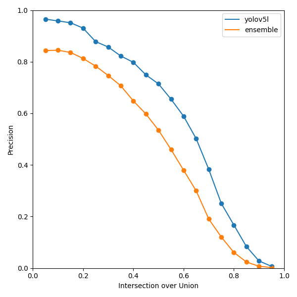

# TartesiaDS
Article repository: [Automated damage assessment of automobiles using computer vision: Case of use in insurance companies.](https://www.mdpi.com/2076-3417/14/20/9560)

To obtain the public dataset of vehicle damage, access the following link: https://docs.google.com/forms/d/e/1FAIpQLSdOm86Tn3hH2TQNlvQS6ghzFgEvSJoj9Tp_QpAlVXDrLhYFyQ/viewform?usp=sf_link

The article details the process of merging boxes to take advantage of the use of various models.

We start from the use of several versions of YOLOv5 testing with various image resolutions.

We compare the model ensemble against a version of yolov5 in different metrics.

  
  
  

We share a small sample of the different types of damage that are part of the dataset that can be obtained through the form.

## Dataset description
Our public dataset contains 108 images, which are divided into 24 images of undamaged vehicles and 84 images with damage present where 226 damages are labelled as scratches, 93 damages are labelled as deformations and 18 damages are labelled as other types of damages such as paint defects, missing parts and breakages.

## Terms of use
This dataset can be used free of charge for academic research, citing the document as explained below. If you wish to use the data for commercial purposes, please contact us.

## Citation
**MDPI and ACS Style**

Pérez-Zarate, S.A.; Corzo-García, D.; Pro-Martín, J.L.; Álvarez-García, J.A.; Martínez-del-Amor, M.A.; Fernández-Cabrera, D. Automated Car Damage Assessment Using Computer Vision: Insurance Company Use Case. Appl. Sci. 2024, 14, 9560. https://doi.org/10.3390/app14209560

**AMA Style**

Pérez-Zarate SA, Corzo-García D, Pro-Martín JL, Álvarez-García JA, Martínez-del-Amor MA, Fernández-Cabrera D. Automated Car Damage Assessment Using Computer Vision: Insurance Company Use Case. Applied Sciences. 2024; 14(20):9560. https://doi.org/10.3390/app14209560

**Chicago/Turabian Style**

Pérez-Zarate, Sergio A., Daniel Corzo-García, Jose L. Pro-Martín, Juan A. Álvarez-García, Miguel A. Martínez-del-Amor, and David Fernández-Cabrera. 2024. "Automated Car Damage Assessment Using Computer Vision: Insurance Company Use Case" Applied Sciences 14, no. 20: 9560. https://doi.org/10.3390/app14209560

**APA Style**

Pérez-Zarate, S. A., Corzo-García, D., Pro-Martín, J. L., Álvarez-García, J. A., Martínez-del-Amor, M. A., & Fernández-Cabrera, D. (2024). Automated Car Damage Assessment Using Computer Vision: Insurance Company Use Case. Applied Sciences, 14(20), 9560. https://doi.org/10.3390/app14209560
